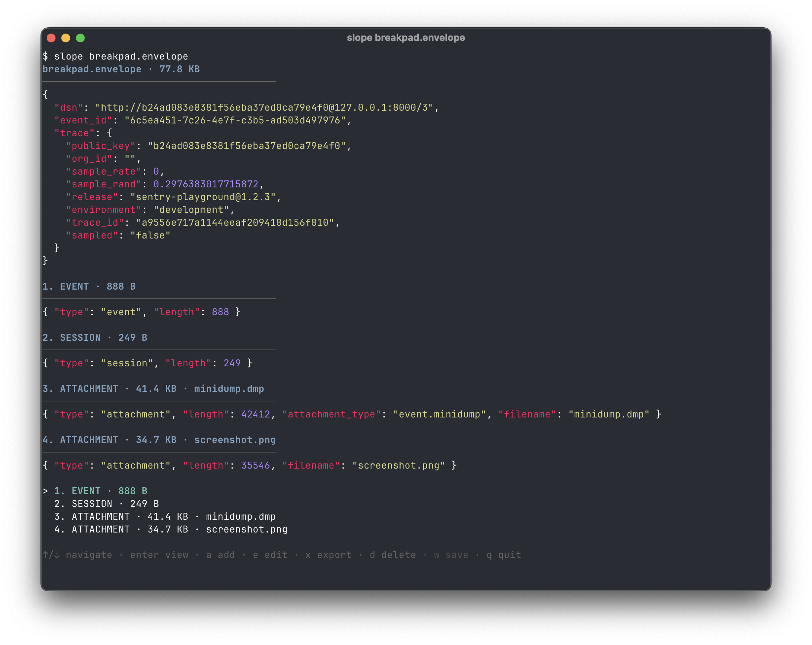

# slope

[](https://go.dev/)
[](https://github.com/jpnurmi/slope/actions/workflows/ci.yml)

A TUI viewer and editor for [Sentry envelopes](https://develop.sentry.dev/sdk/foundations/data-model/envelopes/).



## Features

- Pretty-formatted, syntax-highlighted JSON headers
- Selectable item list with payload viewing via pager
- JSON payloads are pretty-printed and highlighted
- Binary payloads are shown as hex dump
- Add and delete envelope items
- Save modified envelopes back to file

## Install

```
go install github.com/jpnurmi/slope@latest
```

Or build from source:

```
go build -o slope .
```

## Usage

```
slope <file.envelope>
```

### Key bindings

| Key | Action |
|-----|--------|
| `j` / `k` / `Up` / `Down` | Navigate items |
| `Enter` | View item payload in pager |
| `e` | Edit item payload in `$EDITOR` |
| `a` | Add attachment |
| `d` | Delete selected item |
| `w` | Save to file |
| `q` | Quit |
