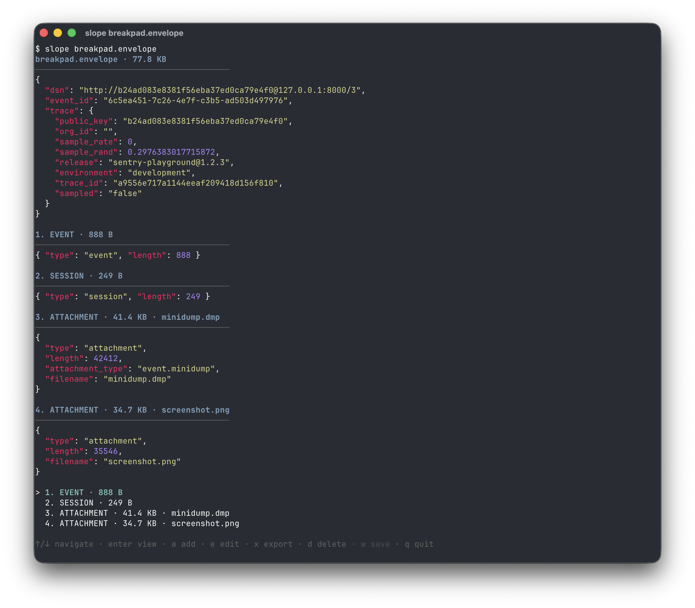

# slope

[](https://github.com/jpnurmi/slope/releases/latest)
[](https://go.dev/)
[](https://github.com/jpnurmi/slope/actions/workflows/ci.yml)
[](https://codecov.io/gh/jpnurmi/slope)

A TUI viewer and editor for [Sentry envelopes](https://develop.sentry.dev/sdk/foundations/data-model/envelopes/).



## Features

- Pretty-formatted, syntax-highlighted JSON headers
- Selectable item list with payload viewing via pager
- JSON payloads are pretty-printed and highlighted
- Image attachments rendered inline with ANSI half-block art
- Minidump crash dumps parsed and displayed as structured data
- Binary payloads are shown as hex dump
- Add, delete, and export envelope items
- Save modified envelopes back to file

## Install

```
go install github.com/jpnurmi/slope@latest
```

Or build from source:

```
go build -o slope .
```

## Usage

### TUI

```
slope <file.envelope>
```

#### Key bindings

| Key | Action |
|-----|--------|
| `j` / `k` / `Up` / `Down` | Navigate items |
| `Enter` | View item payload in pager |
| `e` | Edit item payload in `$EDITOR` |
| `a` | Add attachment |
| `x` | Export item payload to file |
| `d` | Delete selected item |
| `w` | Save to file |
| `q` | Quit |

### CLI

```
slope header <file> [0-N]
slope payload <file> [0-N]
```

Index 0 refers to the envelope header/payload, and 1-N to individual items.
Without an index, both commands list a summary of all entries.

List all headers:
```
$ slope header file.envelope
0: {"dsn":"...","event_id":"..."}
1: {"type":"event","length":888}
2: {"type":"session","length":249}
3: {"type":"attachment","length":42412,"filename":"minidump.dmp"}
```

List all payloads:
```
$ slope payload file.envelope
0: <4 items, 79095 bytes>
1: {"event_id":"...","timestamp":"...","platform":"native","level":"fatal",...}
2: {"init":true,"sid":"...","status":"crashed",...}
3: <binary 42412 bytes>
4: <binary 35546 bytes>
```

Show a specific item header:
```
$ slope header file.envelope 3
{"type":"attachment","length":42412,"filename":"minidump.dmp"}
```

Extract a payload to a file:
```
$ slope payload file.envelope 3 > minidump.dmp
```
